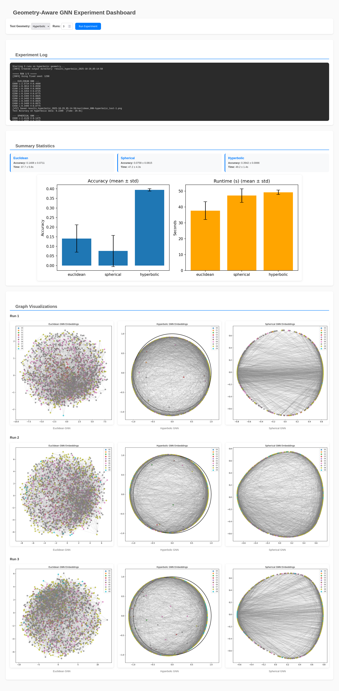

<!-- README.md - Documentation for gnn.py. -->
<!-- Copyright (C) 2025-- Soumendra Ganguly -->

<!-- This program is free software: you can redistribute it and/or modify -->
<!-- it under the terms of the GNU General Public License as published by -->
<!-- the Free Software Foundation, either version 3 of the License, or -->
<!-- (at your option) any later version. -->

<!-- This program is distributed in the hope that it will be useful, -->
<!-- but WITHOUT ANY WARRANTY; without even the implied warranty of -->
<!-- MERCHANTABILITY or FITNESS FOR A PARTICULAR PURPOSE.  See the -->
<!-- GNU General Public License for more details. -->

<!-- You should have received a copy of the GNU General Public License -->
<!-- along with this program.  If not, see <https://www.gnu.org/licenses/>. -->

# Geometry-Aware Graph Neural Networks

A comparative study of Graph Neural Networks (GNNs) operating in different geometric spaces: Euclidean, Spherical, and Hyperbolic geometries.



## Overview

This project demonstrates how the choice of geometric space affects GNN performance on graph-structured data. It includes both a command-line interface and a web dashboard for running experiments and visualizing results.

## Features

- **Three geometric implementations**: Euclidean, Spherical, and Hyperbolic GNNs
- **Multi-run experiments**: Compute mean and standard deviation statistics across multiple runs
- **Graph visualization**: Generate 2D projections of learned embeddings
- **GPU acceleration**: CUDA support for faster training on NVIDIA GPUs
- **Web dashboard**: Interactive interface for running experiments and viewing results in real-time
- **Comprehensive logging**: Track training progress and model performance

## Installation

### Requirements

- Python 3.8+
- PyTorch (with CUDA support for GPU acceleration)
- NetworkX
- NumPy
- Matplotlib
- scikit-learn (for visualization)
- Flask and Flask-SocketIO (for web interface)

### Setup

**For CPU-only:**
```bash
pip install torch numpy networkx matplotlib scikit-learn flask flask-socketio
```

**For GPU acceleration (NVIDIA CUDA):**
```bash
pip install torch torchvision torchaudio --index-url https://download.pytorch.org/whl/cu126
pip install numpy networkx matplotlib scikit-learn flask flask-socketio
```

Verify CUDA availability:
```bash
python -c "import torch; print(f'CUDA available: {torch.cuda.is_available()}')"
```

## Usage

### Command Line Interface

**Run multiple experiments (auto-detects GPU):**
```bash
python gnn.py --test euclidean --runs 5
```

**Run single experiment with fixed seed:**
```bash
python gnn.py --test hyperbolic --seed 42
```

**Force specific device:**
```bash
# Force GPU usage (fails if CUDA unavailable)
python gnn.py --test spherical --device cuda --runs 3

# Force CPU usage
python gnn.py --test euclidean --device cpu
```

**Available options:**
- `--test`: Test geometry (`euclidean`, `spherical`, `hyperbolic`)
- `--runs`: Number of experimental runs (default: 3)
- `--seed`: Random seed for reproducibility
- `--device`: Device to use (`cpu`, `cuda`, `auto` - default: `auto`)
- `--no-save`: Disable saving outputs
- `--quiet`: Suppress verbose output

### Web Dashboard

Start the web server:
```bash
python app.py
```

Navigate to `http://localhost:5000` in your browser to access the interactive dashboard.

## Output

Results are saved in timestamped directories with the format `results_{geometry}_{device}_{timestamp}/`:

Examples:
- `results_euclidean_cuda_2025-10-30_14-23-45/`
- `results_hyperbolic_cpu_2025-10-30_15-10-22/`

Each directory contains:
- **Graph visualizations**: `{model_geom}_GNN-{test_geom}_test-{run}.png`
- **Summary statistics plot**: `multi_run_results.png`
- **JSON results**: `results_summary.json` (multi-run) or `single_run_results.json` (single run)

## Algorithm Details

### Geometries

- **Euclidean**: Standard GNN operating in flat space
- **Spherical**: GNN with normalized embeddings on unit sphere
- **Hyperbolic**: GNN using Poincaré ball model with exponential/logarithmic maps

### Architecture

- 2-layer GNN with 256 hidden dimensions
- ReLU activation and dropout (0.3)
- 500 training epochs with validation monitoring
- Node classification task on Watts-Strogatz graphs (2000 nodes, 10 classes)

### Performance

GPU acceleration (CUDA) provides significant speedup for training.

The implementation automatically detects and uses available GPU resources unless explicitly overridden with `--device`.

## Results Interpretation

The experiments compare how well each geometric GNN performs when:
1. Training and testing on data from the same geometry (matched condition)
2. Training on one geometry but testing on another (transfer condition)

Generally, hyperbolic geometry excels at hierarchical structures, spherical geometry at manifold-like data, and Euclidean geometry provides a baseline.

## Citation

If you use this code in your research, please cite:

```
@misc{gnn2025,
  title={Geometry-Aware Graph Neural Networks},
  author={Soumendra Ganguly},
  year={2025},
  url={https://github.com/8vasu/gnn}
}
```
