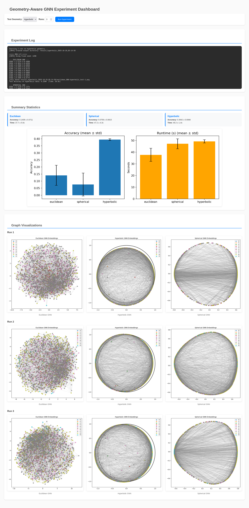

# Geometry-Aware Graph Neural Networks

A comparative study of Graph Neural Networks (GNNs) operating in three different geometric spaces: Euclidean, spherical, and hyperbolic. Includes a real-time web dashboard for running experiments and visualizing results.



## Overview

GNN layers perform two operations at each step: aggregate neighbor features, then transform the result. The geometry determines what "transform" means. A Euclidean GNN applies a plain linear map. A spherical GNN normalizes embeddings onto the unit sphere after each transformation. A hyperbolic GNN maps to the tangent space at the origin via the logarithmic map, applies a linear transformation there, then maps back to the Poincaré ball via the exponential map.

This project compares these three architectures on synthetic node classification tasks where the node features are constructed to be compatible with each geometry by design. This makes the experiment a sanity check rather than a discovery: the matching geometry is expected to win. The value of the project is in the implementation, not the result.

## Data Generation

All three experiments share the same underlying graph. A Watts–Strogatz random graph $G = (V, E)$ with $n = 2000$ nodes, $k = 6$ nearest neighbors, and rewiring probability $p = 0.2$ is generated. This produces a graph with the small-world property: short average path lengths and high local clustering. The symmetrically normalized adjacency matrix with self-loops is

$$\hat{A} = D^{-1/2}(A + I)D^{-1/2}$$

where $D_{ii} = \sum_j (A + I)_{ij}$. This $\hat{A}$ is used for message passing in all three variants.

The node features $x_i \in \mathbb{R}^{128}$ are synthetic: constructed algorithmically to match each geometry rather than measured from any real-world phenomenon.

### Euclidean features

Sample $c = 10$ cluster centers $\mu_1, \ldots, \mu_c \in \mathbb{R}^2$ from $\mathcal{N}(0, 9I_2)$. Assign each node a class label $y_i \in \{0, \ldots, c-1\}$ and sample

$$z_i = \mu_{y_i} + \varepsilon_i, \qquad \varepsilon_i \sim \mathcal{N}(0, 0.25 \cdot I_2).$$

Apply a random orthogonal transformation (via QR decomposition), center, then expand to 128 dimensions via a random projection $W_{\text{exp}} \in \mathbb{R}^{2 \times 128}$ with $W_{jk} \sim \mathcal{N}(0, \frac{1}{2})$, and standardize.

### Spherical features

Place nodes along latitude $\phi_i = \pi i / n$ and longitude $\lambda_i = 2\pi i / n$ on the unit sphere $S^2$:

$$z_i = \begin{pmatrix} \sin\phi_i \cos\lambda_i \\ \sin\phi_i \sin\lambda_i \\ \cos\phi_i \end{pmatrix} + \delta_i, \qquad \delta_i \sim \mathcal{N}(0, 0.0025 \cdot I_3),$$

then normalize $z_i \mapsto z_i / \|z_i\|$. Labels are assigned by latitude band: $y_i = \lfloor ((z_i)_3 + 1) \cdot c / 2 \rfloor$. Expand to 128 dimensions and re-normalize.

### Hyperbolic features

Use BFS from node 0 to assign each node a depth $d_i$. Place node $i$ in the Poincaré disk $\mathbb{D}^2 = \{x \in \mathbb{R}^2 : \|x\| < 1\}$ at

$$z_i = \tanh(0.3\, d_i)\begin{pmatrix}\cos\theta_i \\ \sin\theta_i\end{pmatrix} + \delta_i, \qquad \theta_i = \frac{2\pi\,(i \bmod 2^{\min(d_i,8)})}{2^{\min(d_i,8)}}, \qquad \delta_i \sim \mathcal{N}(0, 0.0025 \cdot I_2).$$

Labels encode depth: $y_i = \min(\lfloor d_i \cdot c / 8 \rfloor,\, c-1)$. Expand to 128 dimensions and standardize.

## GNN Architecture

Each variant is a 2-layer GNN with 256 hidden dimensions, ReLU activation, dropout rate 0.3, trained for 500 epochs with the Adam optimizer.

**Euclidean layer**: standard graph convolution $x \mapsto \hat{A} x W$.

**Spherical layer**: normalize inputs onto $S^{d-1}$, aggregate, transform, apply ReLU, re-normalize.

**Hyperbolic layer**: map from the Poincaré ball to the tangent space at the origin via the logarithmic map $\log_0$, aggregate and transform in the tangent space, map back via the exponential map $\exp_0$:

$$\log_0(x) = \frac{\text{arctanh}(\sqrt{c}\|x\|)}{\sqrt{c}\|x\|} x, \qquad \exp_0(v) = \frac{\tanh(\sqrt{c}\|v\|)}{\sqrt{c}\|v\|} v.$$

## Installation

### Requirements

Python 3.8+, PyTorch, NetworkX, NumPy, Matplotlib, scikit-learn, Flask, Flask-SocketIO.

**CPU only:**
```bash
pip install torch numpy networkx matplotlib scikit-learn flask flask-socketio
```

**GPU (NVIDIA CUDA):**
```bash
pip install torch torchvision torchaudio --index-url https://download.pytorch.org/whl/cu126
pip install numpy networkx matplotlib scikit-learn flask flask-socketio
```

Verify CUDA:
```bash
python -c "import torch; print(torch.cuda.is_available())"
```

## Usage

### Command line

```bash
# Multiple runs, auto-detect GPU
python gnn.py --test euclidean --runs 5

# Single run with fixed seed
python gnn.py --test hyperbolic --seed 42

# Force CPU
python gnn.py --test spherical --device cpu
```

**Options:**
- `--test`: test geometry (`euclidean`, `spherical`, `hyperbolic`)
- `--runs`: number of experimental runs (default: 3)
- `--seed`: random seed for reproducibility
- `--device`: `cpu`, `cuda`, or `auto` (default: `auto`)
- `--no-save`: disable saving outputs
- `--quiet`: suppress verbose output

### Web dashboard

```bash
python app.py
```

Navigate to `http://localhost:5000`. The dashboard streams training logs in real time via SocketIO and renders embedding visualizations and summary plots on completion.

## Output

Results are saved in timestamped directories `results_{geometry}_{device}_{timestamp}/` containing:

- `{model_geom}_GNN-{test_geom}_test-{run}.png`: 2D PCA projections of learned embeddings
- `multi_run_results.png`: accuracy and runtime summary (mean ± std)
- `results_summary.json` or `single_run_results.json`: numerical results